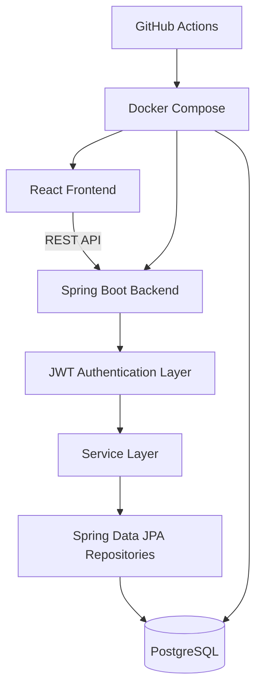

# BlogFlow

A full-stack Blog Management System built with React, Spring Boot, PostgreSQL, JWT authentication, Docker, and GitHub Actions.

## Features

- JWT registration and login with BCrypt password hashing
- Role-based authorization for `ADMIN` and `USER`
- Blog CRUD, search, category filtering, pagination, likes, tags, and comments
- Admin dashboard with user management and statistics
- Responsive React UI with protected routes, toasts, loading states, and dark mode
- Spring Boot layered architecture: controller, service, repository, DTO, security, exception handling
- PostgreSQL persistence with Docker Compose volume
- Swagger UI at `http://localhost:5000/swagger-ui.html`

## Tech Stack

Frontend: React, React Router, Axios, Vite, lucide-react, CSS  
Backend: Spring Boot, Spring Security, Spring Data JPA, Hibernate, Lombok, Maven  
Database: PostgreSQL  
DevOps: Docker, Docker Compose, GitHub Actions

## Local Setup

1. Create PostgreSQL database `blogdb`.
2. Use these environment values or copy `.env.example`:

```env
SPRING_DATASOURCE_URL=jdbc:postgresql://localhost:5432/blogdb
SPRING_DATASOURCE_USERNAME=postgres
SPRING_DATASOURCE_PASSWORD=Nivi-1627
ACCESS_TOKEN_SECRET=blog_access_secret_super_secure_key_32chars
CLIENT_URL=http://localhost:5173
VITE_API_URL=http://localhost:5000/api
```

3. Run backend:

```bash
cd backend
mvn spring-boot:run
```

4. Run frontend:

```bash
cd frontend
npm install
npm run dev
```

Frontend: `http://localhost:5173`  
Backend: `http://localhost:5000`

## Docker Setup

```bash
docker compose up --build
```

Containers:

- `blog-frontend` on `5173`
- `blog-backend` on `5000`
- `blog-postgres` on `5432`

## API

Authentication:

- `POST /api/auth/register`
- `POST /api/auth/login`
- `POST /api/auth/logout`

Blogs:

- `GET /api/blogs?search=&category=&page=0&size=9`
- `GET /api/blogs/{id}`
- `POST /api/blogs`
- `PUT /api/blogs/{id}`
- `DELETE /api/blogs/{id}`
- `POST /api/blogs/{id}/like`

Comments:

- `GET /api/comments/blog/{blogId}`
- `POST /api/comments`
- `PUT /api/comments/{id}`
- `DELETE /api/comments/{id}`

Admin:

- `GET /api/admin/stats`
- `GET /api/admin/users`
- `DELETE /api/admin/users/{id}`

Protected endpoints require:

```http
Authorization: Bearer <jwt>
```

## Architecture



## Deployment

For a Docker server such as AWS EC2, DigitalOcean, Render, Railway, or a VM:

1. Set production secrets for database credentials, JWT secret, Docker Hub, and SSH deployment.
2. Build and push images through `.github/workflows/ci-cd.yml`.
3. On the server, run `docker compose up -d`.
4. Point your domain or reverse proxy to frontend port `5173` and backend port `5000`.
